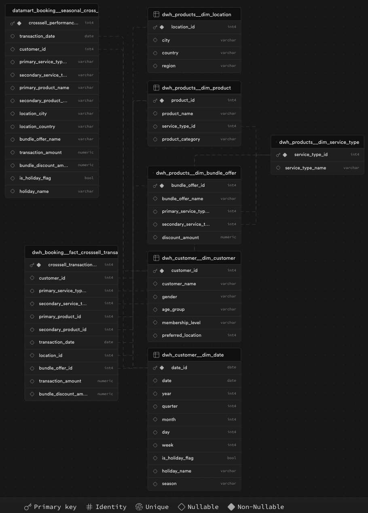
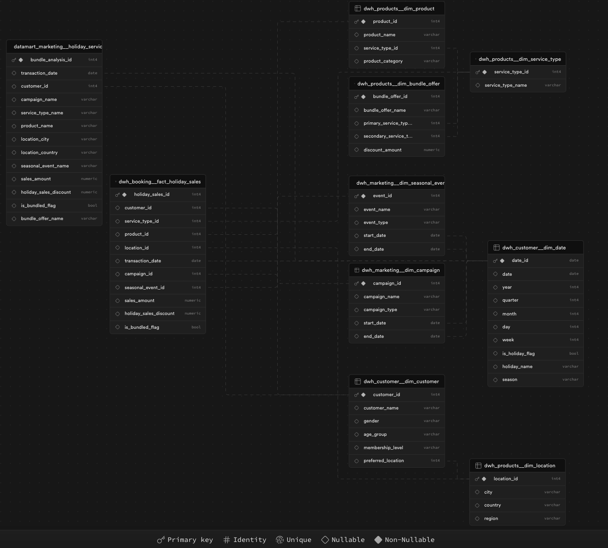
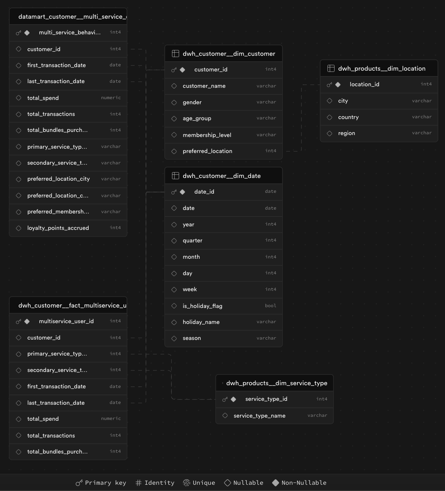

# ota-holiday-cross-sell-dwh
Data Warehouse Business Case on Leveraging Seasonal Holiday Trends to Maximize Cross-Selling Opportunities for Multi-Service Users

## Introduction
The company in this case study operates in the Online Travel Agency (OTA) industry. The main product of this OTA company is a travel and lifestyle application in Southeast Asia. This company's products provide access to find and buy various types of travel needs, local discounts (hotels, villas, homestays, etc.), and financial products (Buy Now Pay Later, promos, ticket discounts, etc.). The company's product portfolio includes transportation booking services such as airline tickets, buses, trains, car rentals, airport shuttles, and access to the largest investment inventory in Southeast Asia. Not only that, to help fulfill more of your lifestyle aspirations, this company also complements entertainment ticket products with various local attractions and activities (Universal Studio tickets, zoo park tours, etc.).

The largest transactions on this company's application occur during the holiday season. During the holiday season, application traffic will be high because potential customers come to buy travel products. When customers make transactions on this company's application, usually customers who initially buy one product will buy another product to complement their trip. For example, a customer will go from Jakarta to Singapore with his family. This customer will initially buy a plane ticket from Jakarta to Singapore for four people. However, after that, they realized that they would need to book a two-night stay at one of the hotels in Singapore, and Universal Studio tickets to enjoy local attractions with the kids. So, the customer who initially only intended to buy a flight product (flight booking) to Singapore, ended up booking a hotel, and local attractions.

This sales activity is known as cross-selling; selling other products to customers who have already purchased one product in succession because of the initial product. This behavior is quite common in the case study of Online Travel Agency companies, so the company wants to provide effective cross-selling of various services during the seasonal holiday period and to understand how customer booking patterns and shopping behaviors change. This will allow the company to refine its combined offerings and target customers with the right products at the right time, ultimately increasing sales and customer satisfaction.

To analyze this trend, the company will utilize a data warehouse that includes company data that has been collected and summarized for needs analysis, with dimensions used in the data warehouse, such as Customer, Product, Service Type, Location, Campaign, Seasonal Event, and Package Offers. These dimensions are taken from the company's backend services, processed and used to analyze changes in product sales patterns during the holiday season and measure the impact of marketing campaigns on those sales.

## Objectives
The primary objective is to evaluate the effectiveness of cross-selling multiple services (e.g., flights and accommodations, transport and local activities) during seasonal holiday periods and to understand how customers' booking patterns and spending behavior change. This will enable the company to refine its bundled offerings and target customers with the right products at the right time, ultimately boosting sales and customer satisfaction.

1. **Seasonal Holiday Sales Trends**:
    - Analyze how sales patterns for different service types (transport, accommodation, local activities) fluctuate during seasonal holidays, such as New Year, Eid, and Christmas.
    - Determine the impact of promotional campaigns aligned with these holidays on the sales volume and average order value.
2. **Cross-Selling Effectiveness**:
    - Evaluate the success of existing cross-selling strategies by measuring the rate at which customers purchase additional services (e.g., adding accommodations after booking flights) during seasonal holidays.
    - Identify which combinations of services (e.g., flights + hotels + local activities) perform best in terms of conversion rates and customer satisfaction.
3. **Multi-Service Customer Behavior Analysis**:
    - Track and compare the booking frequency, average spending, and customer loyalty for users who book multiple services during seasonal holidays versus those who book single services.
    - Determine if seasonal holidays drive higher engagement and spending for multi-service customers compared to regular periods, and identify which user segments are most likely to respond to cross-service promotions.

## Table Catalog
### **Raw Tables**

| **Schema Name** | **Table Name** | **Description** |
| --- | --- | --- |
| `raw_booking` | `raw_flight_booking` | Flight booking transaction details. |
| `raw_booking` | `raw_hotel_booking` | Hotel booking transaction details. |
| `raw_booking` | `raw_car_rental_booking` | Car rental booking details. |
| `raw_booking` | `raw_attraction_booking` | Local attraction booking details. |
| `raw_booking` | `raw_bundle_booking` | Bundle offer booking transactions. |
| `raw_engagement` | `raw_customer_sessions` | Customer sessions and interactions data. |
| `raw_engagement` | `raw_offer_clicks` | Data on clicks on offers/promotions by customers. |
| `raw_engagement` | `raw_page_views` | Page views data for each customer session. |
| `raw_engagement` | `raw_funnel_events` | Details of customer drop-off points and funnel events. |
| `raw_marketing` | `raw_campaign_performance` | Marketing campaign performance metrics. |
| `raw_marketing` | `raw_campaign_sales` | Sales linked to specific marketing campaigns. |
| `raw_marketing` | `raw_seasonal_event_mapping` | Maps campaigns to seasonal events and holidays. |
| `raw_feedback` | `raw_product_reviews` | Customer reviews and ratings for products/services. |
| `raw_feedback` | `raw_complaints_and_resolutions` | Customer complaints and resolution details. |
| `raw_feedback` | `raw_post_purchase_feedback` | Feedback collected after purchases. |
| `raw_products` | `raw_product_catalog` | Product catalog with all services offered. |
| `raw_products` | `raw_product_pricing` | Product pricing information. |
| `raw_products` | `raw_service_type_mapping` | Mapping of products to service types. |
| `raw_products` | `raw_location_mapping` | Maps products to their geographic locations. |
| `raw_customer` | `raw_customer_profile` | Customer demographic and profile information. |
| `raw_customer` | `raw_customer_loyalty_status` | Loyalty status, points accrued, and tier changes. |
| `raw_customer` | `raw_customer_preference` | Customer preferences and booking patterns. |
| `raw_finserv` | `raw_payment_transactions` | Details of each payment transaction. |
| `raw_finserv` | `raw_discount_applications` | Discounts applied during checkout. |
| `raw_finserv` | `raw_refund_transactions` | Refunds processed for products/services. |

### **Data Warehouse Tables**

### Fact Tables

| **Schema Name** | **Fact Table Name** | **Description** |
| --- | --- | --- |
| `dwh_booking` | `fact_crosssell_transaction` | Cross-sell transactions between different services. |
| `dwh_booking` | `fact_holiday_sales` | Holiday-specific sales performance for each service. |
| `dwh_customer` | `fact_multiservice_user` | Multi-service usage metrics by customer. |

### Dimension Tables

| **Schema Name** | **Dimension Table Name** | **Description** |
| --- | --- | --- |
| `dwh_products` | `dim_product` | Product details, including name, category, and type. |
| `dwh_products` | `dim_service_type` | Different types of services (e.g., flights, hotels). |
| `dwh_products` | `dim_location` | Geographic location details of services/products. |
| `dwh_customer` | `dim_customer` | Customer demographic and profile information. |
| `dwh_customer` | `dim_date` | Standard date dimension with holiday flags. |
| `dwh_marketing` | `dim_campaign` | Campaign details, including type and duration. |
| `dwh_marketing` | `dim_seasonal_event` | Seasonal events and holidays data. |
| `dwh_products` | `dim_bundle_offer` | Bundle offer details, mapping primary and secondary services. |

### **Datamart Tables**
| **Schema Name** | **Datamart Table Name** | **Description** |
| --- | --- | --- |
| `datamart_booking` | `seasonal_cross_sell_performance` | Analysis of cross-sell transactions during holidays. |
| `datamart_marketing` | `holiday_service_bundle_analysis` | Analysis of holiday-specific service bundles. |
| `datamart_customer` | `multi_service_customer_behavior` | Customer behavior patterns for multi-service users. |

## Data Warehouse Design
1. **Seasonal Holiday Sales Trends**:

The star schema model in the above ERD is centered around the fact table fact_holiday_sales, which captures metrics related to holiday sales and campaign performance. This fact table is connected to various dimension tables, such as dim_product, dim_service_type, dim_location, dim_bundle_offer, dim_campaign, dim_seasonal_event, dim_customer, and dim_date.

2. **Cross-Selling Effectiveness**:

The star schema model in the ERD above is centered around a fact table; dwh_booking__fact_crosssell_transaction, which records transactional data, and a series of dimension tables; dim_product, dim_service_type, dim_location, dim_bundle_offer, and dim_date; which provide descriptive context for analyzing the facts.

3. **Multi-Service Customer Behavior Analysis**:

The star schema model for the above ERD focuses on analyzing customer behavior and service usage patterns. The fact table; fact_multiservice_user stores key transactional metrics such as total spend, total transactions, and packages purchased by the customer. This fact table is connected to the surrounding dimension tables; dim_customer, dim_service_type, dim_location, and dim_date; which provide descriptive context such as customer details (e.g., demographics, membership level), service type (e.g., flight, hotel), geographic information (e.g., city, country, region), and time attributes (e.g., year, quarter, month, day)
